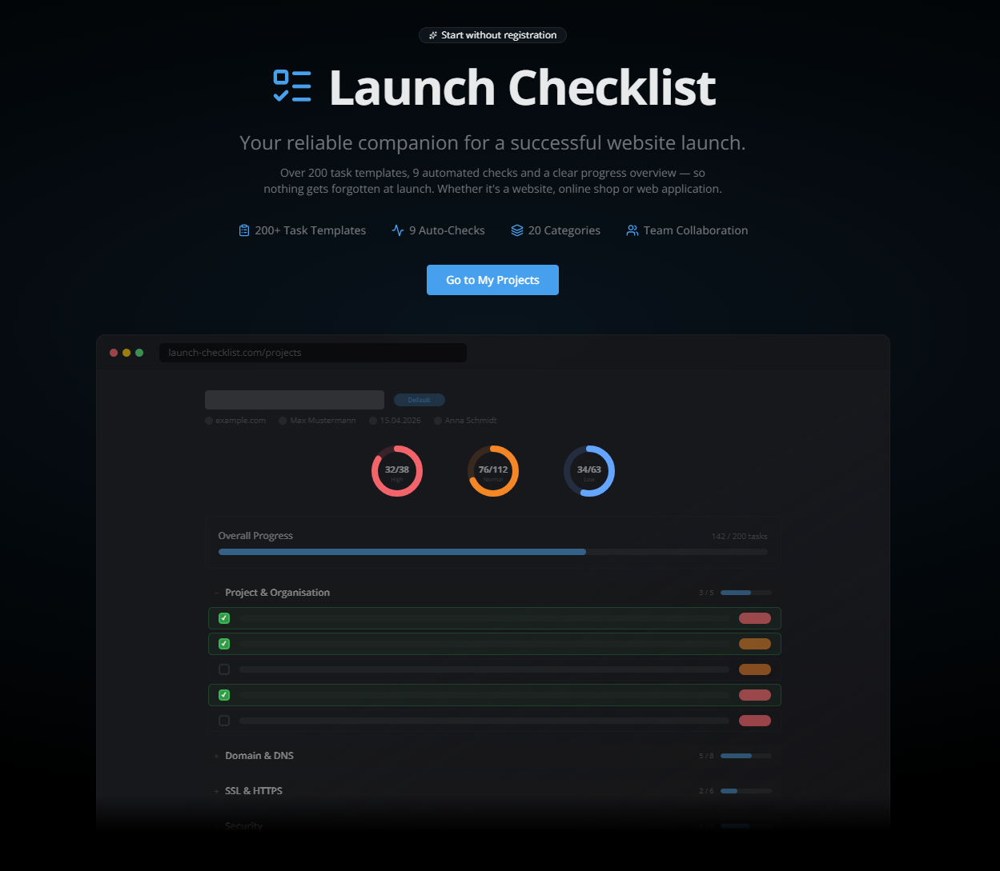

# Launch Checklist

**Your Go-Live Companion — Nothing Gets Forgotten.**

A structured, automated checklist system for website launches. Over 200 pre-built launch tasks, 9 automated verification checks, a public Quick Check tool, team collaboration, and real-time progress tracking — so nothing slips through the cracks.

🌐 **[launch-checklist.com](https://launch-checklist.com)**

---

## Try It Now — Free, No Registration

Two ways to get started **instantly** — no signup, no credit card, no commitment:

### ⚡ Website Quick Check — Instant Website Audit
Enter any website URL and get an immediate health report:

- ✅ 9 automated checks (SSL, security headers, meta tags, Open Graph, sitemap and more)
- 📊 Visual score with radial charts
- 🔧 Fix hints for every failed check
- ⏱️ Results in seconds

👉 **[Run a Website Quick Check](https://launch-checklist.com/quick-check)**

### 📋 Full Launch Checklist
For a structured launch process with over 200 tasks:

1. Choose a template (Default, TYPO3, WordPress)
2. Start checking off tasks
3. Export your progress as PDF
4. Register later to save your data permanently (seamless, no data loss)

👉 **[Start your free checklist now](https://launch-checklist.com/checklist)**

---

## Screenshot



---

## Key Features

### ⚡ Website Quick Check — Public URL Audit Tool

The fastest way to check if a website is launch-ready. **No registration, no account, no setup.** Just enter a URL and get instant results:

- **9 automated checks** run in sequence (same engine as the full Verify system)
- **Two radial charts** — Score percentage and passed task count
- **Live progress** — Watch each check complete in real-time
- **Expandable details** — Click any check to see what was tested, what failed, and how to fix it
- **Single source of truth** — Uses the same task pool as the full checklist, so results are consistent across both views
- **Fix guidance** — For every failed check: "Why it matters" and "How to fix it"
- **Conversion path** — When you're ready for a full launch plan, create a free project with all 200+ tasks
- **Check History** — Registered users see a team-scoped history of past scans with score, checks, and one-click re-scan
- **Anonymous statistics** — Anonymous scans are logged GDPR-compliant (SHA-256 hashed IP) for global usage insights — no personal data stored

👉 **Try it at [launch-checklist.com/quick-check](https://launch-checklist.com/quick-check)**

### Structured Checklists

Over **200 pre-built launch tasks** organized in **20 categories**, covering everything from DNS setup to post-launch monitoring. Each task includes:

- **Why it matters** — contextual explanation of the task's importance
- **How to fix it** — actionable guidance on how to complete it
- **Documentation links** — direct links to official references (51 tasks)
- **Priority level** — Strong, Normal, or Low
- **Drag & Drop** — Reorder tasks within categories to match your workflow

**Categories include:**
Project Organisation, Domain & DNS, Hosting & Infrastructure, SSL & HTTPS, Security, SEO, Robots & Indexing, Redirects & URL Structure, Content, Media & Assets, Design & UX, Performance, Forms & Leads, Tracking & Analytics, Privacy & Legal, Email & Notifications, CMS Backend, Backups & Recovery, Monitoring & Post-Launch, Finalisation & Documentation.

### 9 Automated Checks (Verify System)

Don't just check off tasks manually — let the system **verify them automatically**:

| Check | What It Verifies |
|-------|-----------------|
| **SSL Certificate** | HTTPS reachable, certificate expiry, self-signed detection |
| **robots.txt** | Valid directives, site self-blocking detection, meta noindex/nofollow |
| **sitemap.xml** | Resolves from robots.txt, fallback paths, validates XML |
| **HTTPS Redirect** | HTTP → HTTPS (301/302/307/308), SEO recommendations |
| **Security Headers** | X-Frame-Options, X-Content-Type-Options, HSTS with value validation |
| **Canonical Tag** | HTML tag + HTTP header, multiple tags, www mismatch detection |
| **Meta Tags** | Title/description length, viewport, lang, charset |
| **Open Graph** | og:title, og:image, og:description, image reachability |
| **Favicon** | HTML link tags, /favicon.ico, Apple Touch Icon, manifest |

Works with **password-protected staging environments** (Basic Auth support). Tasks are automatically checked off when verification passes. When a check **fails**, the system provides **specific fix guidance** — explaining why it matters and exactly how to resolve the issue.

### Project Templates

Start with pre-configured templates for different website types:

- **Default** — Universal checklist for any website
- **TYPO3** — Extended with CMS-specific tasks (cache, extensions, TypoScript)
- **WordPress** — Extended with plugin, theme, and security tasks

Save your own project configurations as **reusable templates** for future launches.

### Team Collaboration

Work together on launches with your team:

- **Team roles** — Owner, Admin, Member with granular permissions
- **Task assignment** — Assign tasks to specific team members
- **Comments** — Add notes and discussions per task
- **Email invitations** — Invite team members with one click
- **Multiple teams** — Manage different teams for different clients

### Share Projects — No Login Required

Share any project with stakeholders via a **unique read-only link**:

- **No account needed** — recipients just open the link
- **Optional password** protection (AES-256-GCM encrypted)
- **Configurable expiry** — 7 days, 30 days, or unlimited
- **Live data** — viewers always see current progress (auto-refresh)
- **PDF export** available directly from the shared view

Perfect for sharing launch progress with clients who don't need an account.

### Project Lifecycle

Track your project through its natural lifecycle:

- **Active** → **Completed** (with confetti celebration!) → **Archived**
- Reopen completed projects or unarchive archived ones
- Only team Owners and Admins can manage project status

### Export & Reporting

Generate professional reports in multiple formats:

- **PDF** — For stakeholders and project documentation
- **Markdown** — For wikis and documentation systems
- **JSON** — For integrations and automation
- **Redmine** — Compatible with Redmine project management

### Passwordless Login

- **Magic Link** — Receive a login link via email, no password needed
- **Password Reset** — "Forgot password?" flow with secure email tokens
- **Rate Limited** — All auth endpoints protected against brute-force
- **Anti-Enumeration** — Auth flows never reveal if an email exists

### About / Trust Page

Meet the person behind the tool:

- **Solo-Founder Profile** — 20+ years of web development, 600+ projects
- **Trust Signals** — Three companies, 10 tools and technologies, core values
- **E-E-A-T Optimized** — Google ProfilePage + Article JSON-LD schemas for search credibility
- **Social Links** — LinkedIn, XING, GitHub

👉 **[About Launch Checklist](https://launch-checklist.com/about)**

### AI Discoverability — Grounding Page, llms.txt & Markdown API

Built for the age of AI assistants and LLM-powered search. Launch Checklist makes its product facts machine-readable so tools like ChatGPT, Perplexity, Claude, and Gemini can answer questions about it accurately:

- **[Facts Page](https://launch-checklist.com/facts)** — A dedicated Grounding Page (Spec v1.5) with structured product facts: pricing, features, tech stack, company info, and verification date
- **[llms.txt](https://launch-checklist.com/llms.txt)** — Markdown site overview following the [llmstxt.org](https://llmstxt.org/) standard — a curated map of the site for AI systems
- **Markdown API** (`/api/md/...`) — Every public page is available as pure Markdown for AI crawlers via content negotiation (`Accept: text/markdown`) or explicit URL (`/api/md/about`, `/api/md/facts`, etc.)
- **JSON-LD everywhere** — Organization, WebSite, SoftwareApplication, ProfilePage, Article, BreadcrumbList — on every page
- **Self-describing** — All facts are verified and dated, so LLMs can cite the source with confidence

👉 **[View the Facts Page](https://launch-checklist.com/facts)** · **[View llms.txt](https://launch-checklist.com/llms.txt)**

### Admin Panel

Full control over the system:

- **Task Pool** — Manage all 213 tasks (edit, activate/deactivate, documentation links)
- **User Management** — View users, change roles, team overview
- **System Settings** — SMTP, app name, invitation expiry — all configurable via UI
- **Dashboard** — KPI overview with charts, Website Quick Check statistics split into **all scans** (anonymous + registered) and **registered-only** metrics, recent scans list
- **SMTP Test** — Verify email configuration directly from the admin panel

### Dark Mode & Multilingual

- **Dark and Light mode** with automatic system detection
- Full support for **English** and **German** — including all 213 task definitions
- **Localized URLs** — `/projects` (EN) → `/de/projekte` (DE)
- Adding more languages is as simple as adding one translation file

---

## Privacy First

Launch Checklist takes a **privacy-first approach**:

- **No tracking** — No Google Analytics, no Facebook Pixel, no third-party scripts
- **No consent banner needed** — Only functional cookies (session, team context)
- **Self-hosted** — Your data stays on your server
- **GDPR-compliant** — Full privacy policy included, IP logging with SHA-256 hashing
- **Fonts self-hosted** — No Google Fonts CDN, no external requests

---

## Self-Hosting (Docker)

Deploy on your own server with **zero configuration**:

```bash
docker compose up -d --build
```

That's it. The system automatically:
1. Creates the database
2. Runs all migrations
3. Seeds initial data (213 tasks, categories, templates, admin user)
4. Starts the application

**Update workflow** — just as simple:

```bash
git pull && docker compose up -d --build
```

New migrations and seed data are applied automatically on every start.

**Requirements:** Docker + Docker Compose. Runs on any Linux server (tested on Ubuntu 24.04).

---

## Built With

| Technology | Purpose |
|-----------|---------|
| [Next.js](https://nextjs.org) | React framework (App Router, Server Components) |
| [TypeScript](https://www.typescriptlang.org) | Type-safe development |
| [PostgreSQL](https://www.postgresql.org) | Reliable database |
| [Prisma](https://www.prisma.io) | Type-safe ORM with migrations |
| [Tailwind CSS](https://tailwindcss.com) | Utility-first styling |
| [shadcn/ui](https://ui.shadcn.com) | UI component library |
| [Auth.js](https://authjs.dev) | Authentication (credentials + magic link) |
| [next-intl](https://next-intl.dev) | Internationalization with localized URLs |
| [Nodemailer](https://nodemailer.com) | Transactional email (invitations, magic links) |
| [Docker](https://www.docker.com) | Zero-config containerized deployment |

---

## Who Is It For?

- **Web agencies** managing multiple client launches
- **Freelancers** who want a professional launch process
- **Website owners** launching their first site
- **Development teams** deploying software and web applications
- **DevOps engineers** managing infrastructure go-lives

---

## About

Launch Checklist is developed by **[INGENIUMDESIGN](https://www.ingeniumdesign.de)** — a web agency specializing in professional web development and digital solutions.

---

## Links

- 🌐 **Website**: [launch-checklist.com](https://launch-checklist.com)
- ⚡ **Website Quick Check**: [launch-checklist.com/quick-check](https://launch-checklist.com/quick-check)
- 🚀 **Free Checklist**: [launch-checklist.com/checklist](https://launch-checklist.com/checklist)
- 👤 **About**: [launch-checklist.com/about](https://launch-checklist.com/about)
- 📊 **Facts (Grounding Page)**: [launch-checklist.com/facts](https://launch-checklist.com/facts)
- 🤖 **llms.txt**: [launch-checklist.com/llms.txt](https://launch-checklist.com/llms.txt)
- 📋 **Changelog**: [launch-checklist.com/changelog](https://launch-checklist.com/changelog)

---

*Launch Checklist — Because every successful launch starts with a checklist.* ✅
